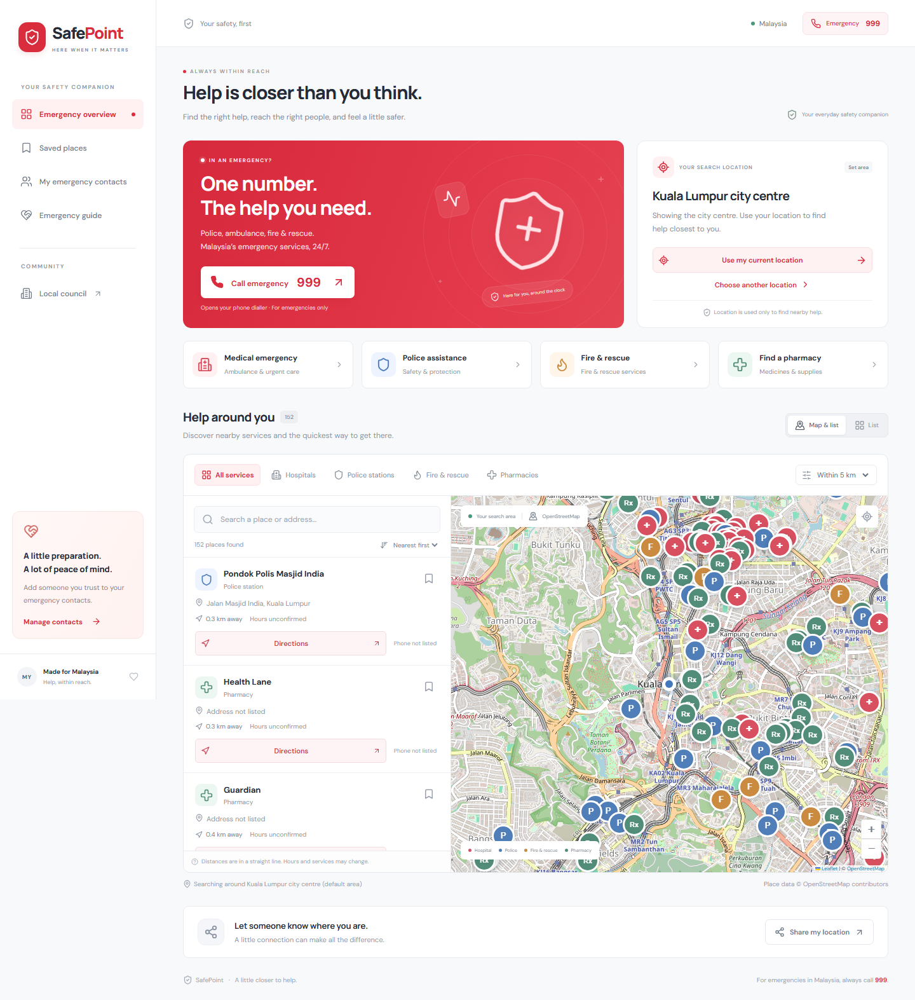

# SafePoint

A red and white emergency companion for Malaysia, built from the **innovation_license1** Next.js blueprint.



## What it does

- Opens the phone dialler with **999** for Malaysia's emergency services.
- Finds nearby hospitals, police stations, fire stations, and pharmacies using device location or a selected area.
- Shows an interactive map, category filters, name/address search, and distance sorting with 2, 5, 10, or 20 km search radii.
- Opens directions in Google Maps and facility calls when a phone number is listed.
- Saves places and personal emergency contacts in the current browser.
- Shares a fresh, one-time device location through the system share sheet or a copied link.
- Reads searchable council zones from the authenticated **Rebana License sandbox API**.
- Handles denied location access, unavailable services, no matching results, and rate limiting.

The initial search centre is **Kuala Lumpur city centre**, explicitly labelled as a default. It is never presented as the user's location. Geolocation requires permission and HTTPS, except on localhost. Clicking a call link opens a compatible phone application; SafePoint does not place a call automatically or dispatch responders.

## Run locally

Use Node.js 22 or later.

```sh
npm ci
cp .env.example .env.local
# Configure the four SANDBOX_* credentials in .env.local.
npm run dev
```

On Windows PowerShell, use `Copy-Item .env.example .env.local` and `npm.cmd` if script execution is restricted. If `.env.local` is already configured, keep it.

Open **http://localhost:3400**.

```sh
npm run build
npm start
```

## API integration and blueprint

The blueprint's `src/core/auth`, `src/core/http`, and `src/shared/models` / `services` layers are retained. The emergency feature uses Redux Toolkit, typed hooks, a feature reducer, and an asynchronous effect under `src/modules/emergency`. Server routes remain under the Next.js App Router.

The [specified Rebana API](https://rebana.canang.com.my/rebana-license/v3/api-docs/sandbox) provides `ping`, `zones`, `license-types`, `business-activities`, and `statistics`. **It does not provide hospital locations, emergency numbers, or an emergency-facility directory.** SafePoint uses council zones in the Local council screen and retains the blueprint's other reference services for extension. It uses [OpenStreetMap Overpass](https://wiki.openstreetmap.org/wiki/Overpass_API) for facility locations, names, phone numbers, hours, and emergency-service tags.

| Route | Purpose |
| --- | --- |
| `GET /api/nearby?lat=3.1517&lon=101.6943&radius=5` | Validated nearby-place lookup via Overpass |
| `GET /api/sandbox/zones?offset=0&limit=200` | Council zones with server-held authentication |
| `GET /api/sandbox/ping` | Sandbox connectivity |
| `GET /api/sandbox/{license-types,business-activities,statistics}` | Blueprint reference resources |

Council reads paginate until a short page. The gateway handles token caching, one refresh on HTTP 401, request timeouts, and the documented `SANDBOX_RATE_LIMITED` response. The UI honours the retry delay. The server proxy restricts resource names and pagination values. Tokens and credentials never enter client bundles or API responses.

Facility queries use a bounded five-minute in-memory cache and combine duplicate concurrent requests. Incomplete Overpass responses are treated as errors, not as complete results. Unknown hours, missing phone numbers, and unconfirmed emergency departments are explicitly labelled. Distances are straight-line distances; travel routes are delegated to Google Maps. The app does not infer that a hospital has an emergency department, or claim real-time opening status.

## Configuration

Copy the sandbox credentials issued by the council administrator in **Tetapan → Sandbox Pembangun** into server environment variables:

```dotenv
SANDBOX_BASE_URL=https://rebana.canang.com.my/rebana-license
SANDBOX_CLIENT_ID=rebana-license-sandbox-client
SANDBOX_CLIENT_SECRET=
SANDBOX_USERNAME=license-sandbox
SANDBOX_PASSWORD=
```

The nearby directory and calling links work independently of the council credentials. No maps API key is required. Keep `.env.local` private; it is ignored by Git.

## Data and privacy

- Contacts and bookmarks are stored only in this browser's local storage. They are not synced between devices. Clearing browser data removes them.
- Device coordinates are not persisted to a database or local storage. Nearby searches send coordinates to the app server and Overpass; the server temporarily caches rounded search centres and results. Hosting request logs may contain search coordinates.
- Map tiles load from OpenStreetMap and typography from Google Fonts. Directions and explicitly shared links use Google Maps.
- Sharing obtains a new device location. It does not silently share the default city, track movement, send SMS, or notify emergency services.
- The 999 number and guidance are based on the [official Malaysian government emergency service page](https://www.malaysia.gov.my/en/categories/safety-and-community/public-safety/mers-999-emergency-line).
- OpenStreetMap is a community-maintained directory, not a verified emergency dispatch feed. Call 999 for an emergency. The directory and basemap need an internet connection; this is not a full offline application.

## Validation

```sh
npm run typecheck
npm test
npx playwright install chromium
npm run test:e2e
npm run build
```

Unit tests cover distances, coordinates, phone links, facility normalization, and stale request protection. Browser tests cover filters, bookmarks, persisted contacts, location denial, manual search areas, sharing, maps, service errors, council pagination/rate limiting, input validation, and mobile navigation. Browser tests use explicit fixtures and do not place calls. The live Rebana and Overpass integrations were also checked separately.

To capture screenshots from the running app with live data:

```sh
node scripts/capture.mjs
```

Screenshots are written to ignored `artifacts/`. The checked-in preview in `docs/` contains public facility data, not device coordinates or personal contacts.

## Deployment

Deploy as a Node.js Next.js application (not a static export), configure the five environment variables above, and enable HTTPS for location/sharing support. GitHub stores the source; pushing the repository does not deploy a hosted website.

For a public deployment, apply hosting-level rate limits to `/api/nearby` and `/api/sandbox/*` to protect third-party service quotas. The council proxy has no user authentication and shares the sandbox credential's upstream request budget. Its authenticated requests must remain server-side.
